# API Notebook in Anypoint Platform and API Developer Portal

> The API Notebook can create a client for an API when you specify the URL for the API&#39;s RAML spec. With that client you can send authenticated requests to the API and receive live data in return.

- Here user need not to install any thing in his local we just needed to share the URL

- URL of the API in Developer Portal.

## Creating a Notebook:

- Login to Anypoint Platform

- Create RML in Design Centre

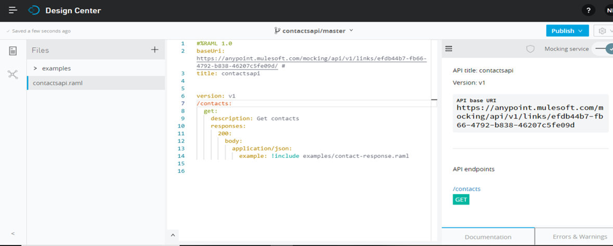

- Click on publish to Exchange

##

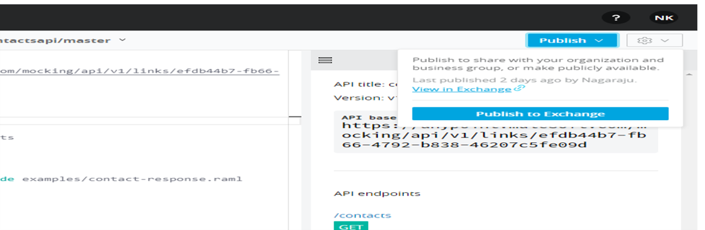

- Go to Exchange there you can see the API get published

 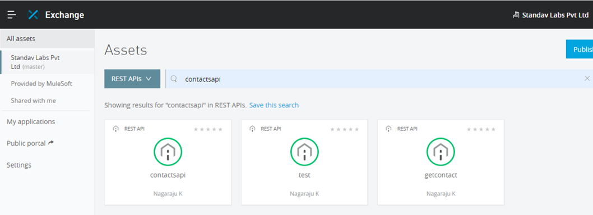

- •	Now open the published API and Click on Edit in the Top Right corner

 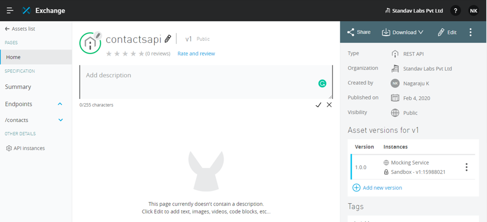

- Now Click on API Notebook a snippet gets Generated

 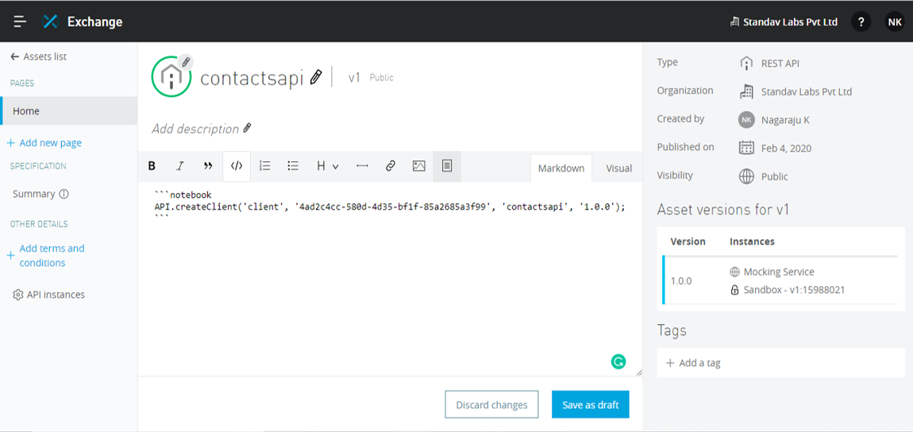

- Repeat the same by clicking on the API Notebook and Click on  Save Draft

 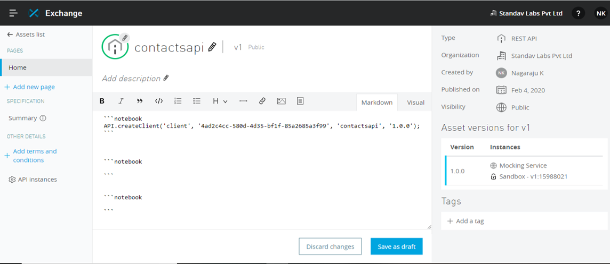

- Now Click on Publish  so the API Notebook get created

 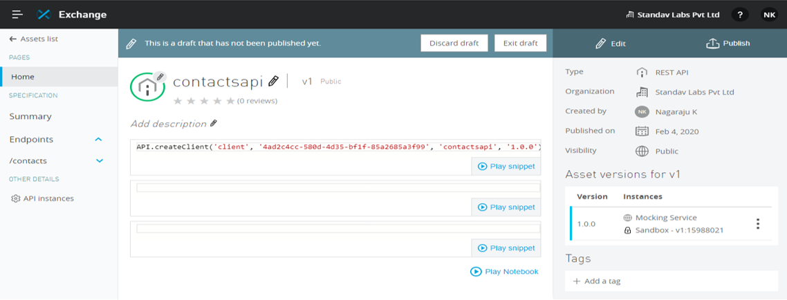

- Now Play the first snippet so the client gets created.
- After the client created play the Next Snippet so can see the  Mock response from Response

 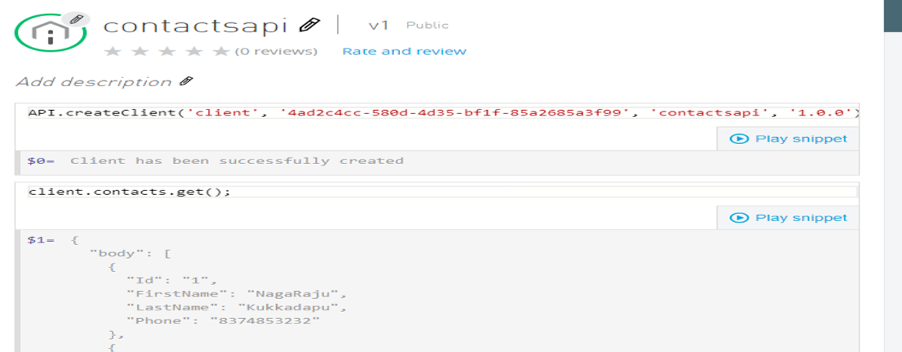

- Now Publish the API to Developer Portal.
- In the top right corner click on share and then select public and select the API  version and click on Save

 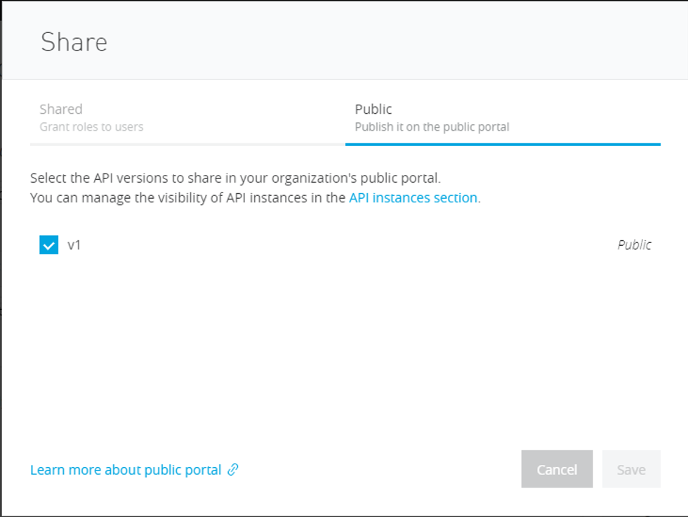

- Now go back to Exchange and Click on Public Portal in the left edge.

 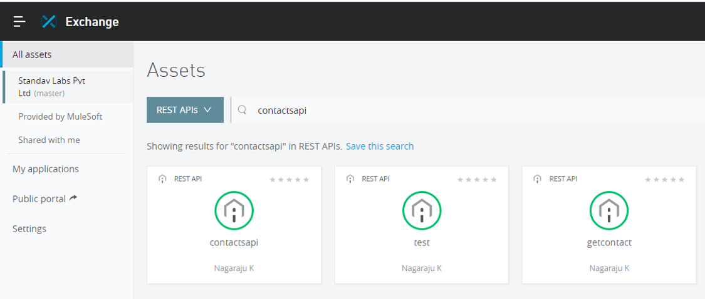

- Now the API can be seen in the Developer Portal Open the API you can see the API Published with API Notebook the Only thing you need to do is share the URL of the API in the Developer Portal so User can see the Mock Response.

 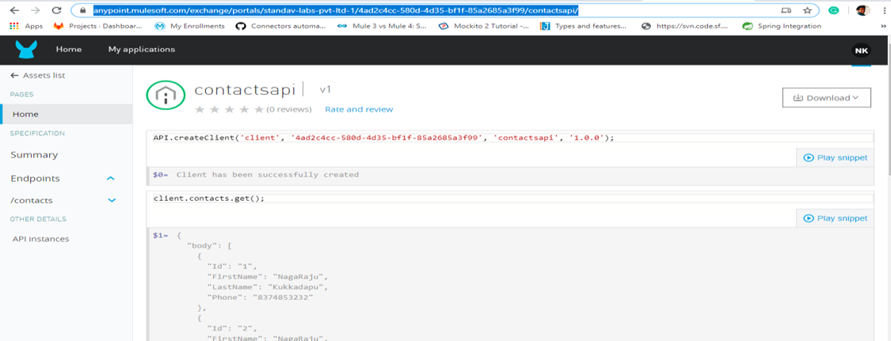

- If the API is with Client id Enforcement, we need to pass the client\_id and client\_secret as Headers as below.

 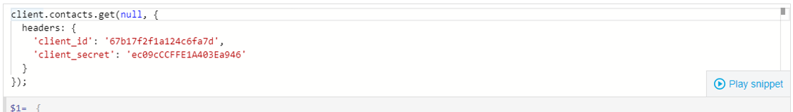

- If you need to pass the Post method with Parameters

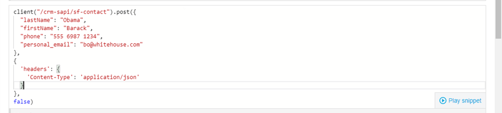

 
